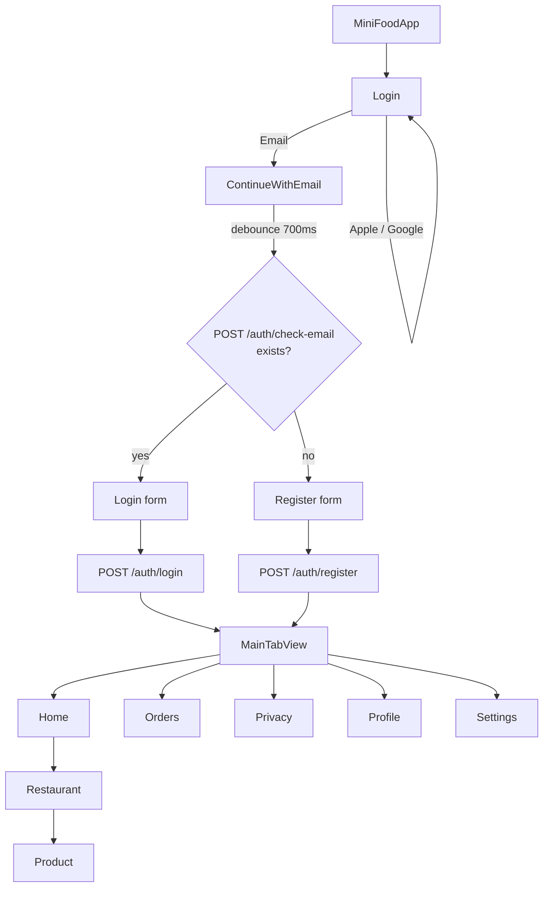

# MiniFood (Fresko)

A food‑delivery iOS app built with **SwiftUI** as a personal project to practice my studies in modern Apple development: SwiftUI, the **Observation** framework, **async/await**, **MVVM** and REST API integration.

> Xcode project: `MiniFood` • App display name: `Fresko`

## About

**MiniFood / Fresko** simulates a delivery app: the user signs in, browses restaurants, opens a product and (eventually) places an order. It is a **study project** — the goal is to use a realistic domain as an excuse to exercise navigation, state management, reusable components, networking and authentication.

## Tech stack

- **Swift 5** + **SwiftUI** (iOS 26.2 target)
- **`@Observable`** (Observation framework) for ViewModels
- **`async`/`await`** + `URLSession` + `Codable` for networking
- **MVVM** with a Service layer behind a `protocol`
- `NavigationStack` for navigation

## Architecture

The app follows **MVVM + Service layer**, organized by feature:

```
View (SwiftUI)  ──▶  ViewModel (@Observable)  ──▶  Service (protocol)  ──▶  REST API
```

- **View**: dumb, binds to ViewModel state.
- **ViewModel**: `@Observable` class holding UI state (`isLoading`, `errorMessage`, ...) and orchestrating calls.
- **Service**: a `struct` conforming to a feature `protocol` (e.g. `ContinueWithEmailProtocol`), so it can be mocked in tests/previews.
- **Models**: plain `Codable` structs next to the feature that owns them.
- **Errors**: typed `enum AuthServiceError: LocalizedError` exposed to the UI via `error.localizedDescription`.

## Project structure

```
MiniFood/
├── MiniFoodApp.swift           # @main entry point
├── Components/Header.swift     # Reusable header
├── Core/
│   ├── TabView.swift           # MainTabView (custom tab bar)
│   ├── Login/                  # Login screen
│   ├── ContinueWithEmail/      # MVVM: View / ViewModel / Services / Model
│   ├── Home/ • Restaurant/ • Product/ • Settings/
│   └── Model/TabItemModel.swift
├── Networking/Error/           # AuthServiceError
├── Helpers/                    # tabBarVisibility (Environment)
└── Assets.xcassets/
```

## API integration

Backend communication uses `URLSession` + `async/await`. The full contract is in [`docs/BACKEND_AUTH.md`](docs/BACKEND_AUTH.md).

**Base URL:** `http://localhost:3000/v1/`

| Method | Endpoint            | Used by                                  |
|--------|---------------------|------------------------------------------|
| POST   | `/auth/check-email` | `ContinueWithEmailService.validEmail`    |
| POST   | `/auth/register`    | `ContinueWithEmailService.registerUser`  |

Example of a feature wiring everything together:

```swift
protocol ContinueWithEmailProtocol {
    func validEmail(email: String) async throws -> ValidEmailModel
    func registerUser(user: UserModel) async throws -> UserReponse
}

@Observable
class ContinueWithEmailViewModel {
    var email = ""; var password = ""
    var isLoading = false
    var errorMessage: String? = nil

    private let service: ContinueWithEmailProtocol
    init(service: ContinueWithEmailProtocol) { self.service = service }
}
```

## App flow

High‑level navigation:

```
MiniFoodApp
└── Login                                  ← entry point
    ├── [Apple]   (not wired yet)
    ├── [Google]  (not wired yet)
    └── [Email] ──▶ ContinueWithEmail
                    │
                    │  user types email
                    │  debounce 700ms
                    │  POST /auth/check-email
                    ▼
              ┌─────────────────────────┐
              │  exists == true?        │
              └─────────────────────────┘
                 │                   │
                 ▼ yes               ▼ no
              Login form         Register form
              (password)         (name + password + confirm)
                 │                   │
                 │     POST /auth/register
                 └─────────┬─────────┘
                           ▼
                       MainTabView
                           │
   ┌───────────┬───────────┼────────────┬───────────┐
   ▼           ▼           ▼            ▼           ▼
  Home       Orders      Privacy      Profile    Settings
   │
   ▼
 Restaurant ──▶ Product
```

Mermaid version (renders on GitHub):



Key behaviors:

- The **email input is debounced (700ms)** before calling the API to avoid a request per keystroke.
- The response of `/auth/check-email` decides whether `ContinueWithEmail` shows the **Login** form or the **Register** form.
- On success the ViewModel flips `shouldEnterTheApp = true`, which triggers `navigationDestination` to push `MainTabView`.
- Inside `MainTabView`, the custom tab bar can be hidden by any child view via `.hidesTabBar()` (used on detail screens).

## Getting started

Requirements: Xcode with iOS 26 SDK, simulator running iOS 26.2+.

```bash
git clone https://github.com/<your-user>/MiniFood.git
cd MiniFood
open MiniFood.xcodeproj
```

Start a backend on `http://localhost:3000` (see `docs/BACKEND_AUTH.md`) or change the base URL in `ContinueWithEmailService.swift`, then press **⌘R**.

## Roadmap

- [ ] Keychain for `accessToken` / `refreshToken`
- [ ] `SessionManager` + route guard (Login vs MainTabView)
- [ ] Generic `APIClient`
- [ ] ViewModels for Home / Restaurant / Product
- [ ] Sign in with Apple & Google
- [ ] Logout from Settings
- [ ] Unit tests for ViewModels with mock services

## Author

Made by **Thiago Lourenço** as a SwiftUI study project. Feedback on architecture and SwiftUI idioms is very welcome.
